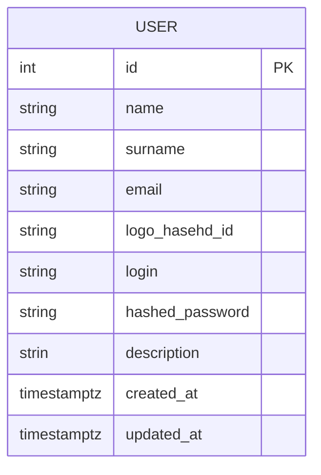
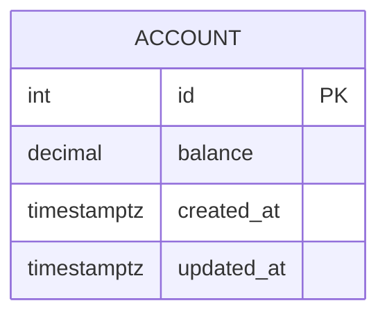
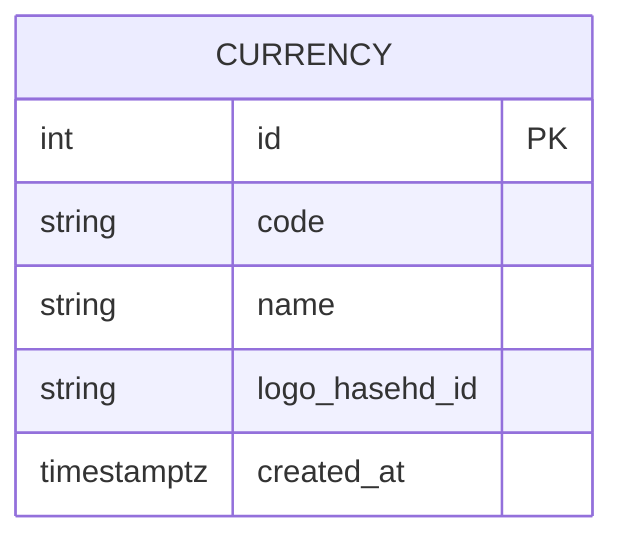
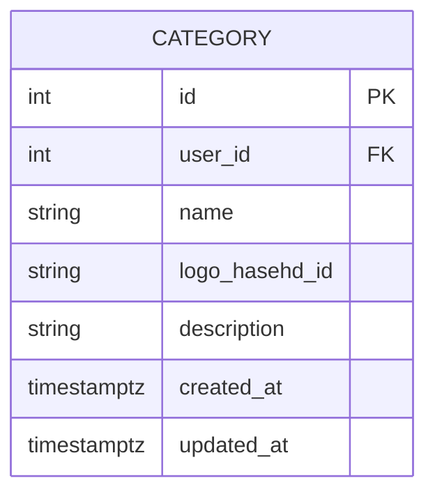
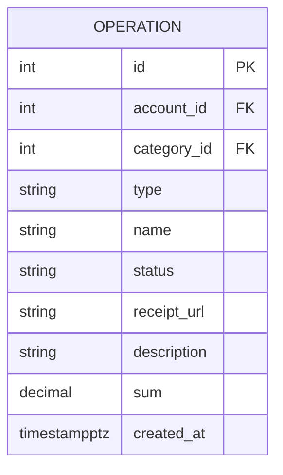
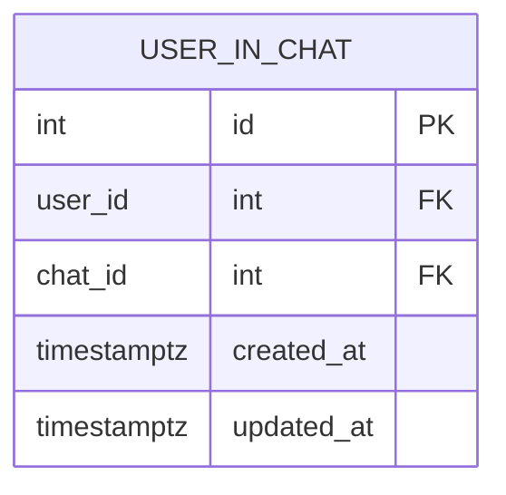

## Таблица USER

Таблица `USER` содержит информацию о пользователях сервиса.

 Функциональные зависимости: 

- `{id} -> {name, surname, email, logo_hasehd_id, login, password, created_at, updated_at}`

 Нормальные формы: 

- 1 НФ: Атрибуты id, name, surname, email, logo_hasehd_id, login, password, created_at, updated_at являются атомарными.
- 2 НФ: Атрибуты id, name, surname, email, logo_hasehd_id, login, password, created_at, updated_at полностью функционально зависят от первичного ключа id.
- 3 НФ: Атрибуты id, name, surname, email, logo_hasehd_id, login, password, created_at, updated_at не зависят от других атрибутов.
- НФБК: 3 НФ + в таблице отсутствуют составные ключи.

## Таблица ACCOUNT

Таблица `ACCOUNT` содержит информацию о счете пользователя.

 Функциональные зависимости: 

- `{id} -> {balance, created_at, updated_at}`

 Нормальные формы: 

- 1 НФ: Атрибуты id, balance, created_at, updated_at являются атомарными.
- 2 НФ: Атрибуты id, balance, created_at, updated_at полностью функционально зависят от первичного ключа id.
- 3 НФ: Атрибуты id, balance, created_at, updated_at не зависят от других атрибутов.
- НФБК: 3 НФ + в таблице отсутствуют составные ключи.

## Таблица SHARINGS

Таблица `SHARINGS` является связующей между пользователем и счетом, позволяя таким образои нескольким пользователям иметь один счет.

 Функциональные зависимости: 

- `{id} -> {user_id, account_id, created_at, updated_at}`
- `{(account_id, user_id)} -> {id, created_at, updated_at}`

 Нормальные формы: 

- 1 НФ: Атрибуты id, user_id, account_id, created_at, updated_at являются атомарными.
- 2 НФ: Атрибуты id, user_id, account_id, created_at, updated_at полностью функционально зависят от первичного ключа id.
- 3 НФ: Атрибуты id, user_id, account_id, created_at, updated_at не зависят от других атрибутов.
- НФБК: 3 НФ + в таблице отсутствуют составные ключи.

## Таблица CURRENCY

Таблица `CURRENCY` содержит информацию о валюте.

 Функциональные зависимости: 

- `{id} -> {code, name, logo_hasehd_id, created_at}`

 Нормальные формы: 

- 1 НФ: Атрибуты id, code, name, logo_hasehd_id, created_at являются атомарными.
- 2 НФ: Атрибуты id, code, name, logo_hasehd_id, created_at полностью функционально зависят от первичного ключа id.
- 3 НФ: Атрибуты id, code, name, logo_hasehd_id, created_at не зависят от других атрибутов.
- НФБК: 3 НФ + в таблице отсутствуют составные ключи.

## Таблица BUDGET

Таблица `BUDGET` содержит информацию о бюджетах пользователя.

 Функциональные зависимости: 

- `{id} -> {user_id, amount, currency_id, is_failed, created_at, updated_at, closed_at, period_start, period_end}`
- `{(user_id, category_id, currency_id, period_start, period_end)} -> {id, amount, is_failed, created_at, updated_at, closed_at}`

 Нормальные формы: 

- 1 НФ: Атрибуты id, user_id, amount, currency_id, type, is_failed, created_at, updated_at, closed_at, period_start, period_end являются атомарными.
- 2 НФ: Атрибуты id, user_id, amount, currency_id, type, is_failed, created_at, updated_at, closed_at, period_start, period_end полностью функционально зависят от первичного ключа id.
- 3 НФ: Атрибуты id, user_id, amount, currency_id, type, is_failed, created_at, updated_at, closed_at, period_start, period_end не зависят от других атрибутов.
- НФБК: 3 НФ + в таблице отсутствуют составные ключи.

## Таблица CATEGORY

Таблица `CATEGORY` содержит информацию о категориях транзакций.

 Функциональные зависимости: 

- `{id} -> {user_id, name, logo_hasehd_id, created_at, updated_at}`
- `{(user_id, category_name)} -> {id, created_at, updated_at, logo_hasehd_id}`

 Нормальные формы: 

- 1 НФ: Атрибуты id, user_id, name, logo_hasehd_id, created_at, updated_at являются атомарными.
- 2 НФ: Атрибуты id, user_id, name, logo_hasehd_id, created_at, updated_at полностью функционально зависят от первичного ключа id.
- 3 НФ: Атрибуты id, user_id, name, logo_hasehd_id, created_at, updated_at не зависят от других атрибутов.
- НФБК: 3 НФ + в таблице отсутствуют составные ключи.

## Таблица OPERATION

Таблица `OPERATION` содержит информацию о транзакциях пользователей.

 Функциональные зависимости: 

- `{id} -> {account_id, category_id, type, name, sum, created_at, updated_at}`

 Нормальные формы: 

- 1 НФ: Атрибуты id, account_id, category_id, type, name, status, receipt_url, sum, created_at, updated_at являются атомарными.
- 2 НФ: Атрибуты id, account_id, category_id, type, name, status, receipt_url, sum, created_at, updated_at полностью функционально зависят от первичного ключа id.
- 3 НФ: Атрибуты id, account_id, category_id, type, name, status, receipt_url, sum, created_at, updated_at не зависят от других атрибутов.
- НФБК: 3 НФ + в таблице отсутствуют составные ключи.

## Таблица TRANSFER

Таблица `TRANSFER` содержит информацию о о переводах между пользовательскими счетами.

 Функциональные зависимости: 

- `{id} -> {from_account_id}`

 Нормальные формы: 

- 1 НФ: Атрибуты id, from_account_id являются атомарными.
- 2 НФ: Атрибуты id, from_account_id полностью функционально зависят от первичного ключа id.
- 3 НФ: Атрибуты id, from_account_id не зависят от других атрибутов.
- НФБК: 3 НФ + в таблице отсутствуют составные ключи.

## Таблица CHAT

Таблица `CHAT` содержит информацию о чате между пользователями.

 Функциональные зависимости: 

- `{id} -> {created_at, updated_at}`

 Нормальные формы: 

- 1 НФ: Атрибуты id, created_at, updated_at являются атомарными.
- 2 НФ: Атрибуты id, created_at, updated_at полностью функционально зависят от первичного ключа id.
- 3 НФ: Атрибуты id, created_at, updated_at не зависят от других атрибутов.
- НФБК: 3 НФ + в таблице отсутствуют составные ключи.

## Таблица MESSAGE

Таблица `MESSAGE` содержит информацию о сообщении пользователя.

 Функциональные зависимости: 

- `{id} -> {user_id, chat_id, message_text, created_at, updated_at}`

 Нормальные формы: 

- 1 НФ: Атрибуты id, user_id, chat_id, message_text, created_at, updated_at являются атомарными.
- 2 НФ: Атрибуты id, user_id, chat_id, message_text, created_at, updated_at полностью функционально зависят от первичного ключа id.
- 3 НФ: Атрибуты id, user_id, chat_id, message_text, created_at, updated_at не зависят от других атрибутов.
- НФБК: 3 НФ + в таблице отсутствуют составные ключи.

## Таблица USER_IN_CHAT

Таблица `USER_IN_CHAT` является связующей между пользователем и чатом, позволяя таким образои нескольким пользователям общаться в одном чате.

 Функциональные зависимости: 

- `{id} -> {user_id, chat_id, created_at, updated_at}`
- `{(user_id, chat_id)} -> {id created_at, updated_at}`

 Нормальные формы: 

- 1 НФ: Атрибуты id, user_id, chat_id, created_at, updated_at являются атомарными.
- 2 НФ: Атрибуты id, user_id, chat_id, created_at, updated_at полностью функционально зависят от первичного ключа id.
- 3 НФ: Атрибуты id, user_id, chat_id, created_at, updated_at не зависят от других атрибутов.
- НФБК: 3 НФ + в таблице отсутствуют составные ключи.

## Таблица RECEIVER

Таблица `RECEIVER` содержит информацию о не являющихся пользователями получателями средств в результате транзакций.

 Функциональные зависимости: 

- `{id} -> {user_id, chat_id, created_at, updated_at}`
- `{(user_id, receiver_name)} -> {id, created_at, updated_at}`

 Нормальные формы: 

- 1 НФ: Атрибуты id, user_id, name, created_at, updated_at являются атомарными.
- 2 НФ: Атрибуты id, user_id, name, created_at, updated_at полностью функционально зависят от первичного ключа id.
- 3 НФ: Атрибуты id, user_id, name, created_at, updated_at не зависят от других атрибутов.
- НФБК: 3 НФ + в таблице отсутствуют составные ключи.

